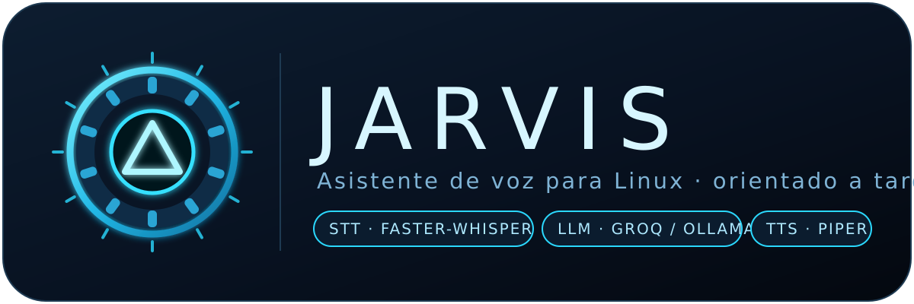

<p align="center">
  
</p>

<p align="center"><strong>Asistente de voz para Linux, orientado a tareas.</strong><br/>
Escucha · Transcribe · Ejecuta · Responde breve o en silencio.</p>

<p align="center">
  
  
  
  
  
  
</p>

## ⚡ Comando maestro

Un solo comando lo hace todo — crea el venv, instala dependencias, genera el `.env` y arranca:

```bash
git clone https://github.com/jeronimoparra-ai/jarvis.git
cd jarvis
./jarvis.sh
```

| Comando | Qué hace |
|---|---|
| `./jarvis.sh` | Prepara el entorno y **arranca Jarvis** (terminal) |
| `./jarvis.sh gui` | **Interfaz web minimalista** en http://127.0.0.1:8765 (chat + accesos rápidos + avisos de temporizadores) |
| `./jarvis.sh test` | Prepara el entorno y **ejecuta los tests** |
| `./jarvis.sh setup` | **Solo prepara** el entorno, sin arrancar |
| `./jarvis.sh install` | **App de escritorio**: icono + lanzadores en el menú (terminal y GUI) |
| `./jarvis.sh install --autostart` | Además arranca la GUI al iniciar sesión |
| `./jarvis.sh warmup` | Pre-descarga STT (~500 MB) + VAD + voz para hablar sin esperas |

> Si los opcionales (micrófono/wake-word) no se pueden instalar por falta de `portaudio`, el script avisa y sigue: Jarvis arranca en modo simulación por teclado. Para micrófono real: `sudo apt install -y portaudio19-dev` y re-ejecuta `./jarvis.sh`.

¿Prefieres el control manual? Sigue a [📦 Instalación](#-instalación).

---

## ✨ ¿Qué es Jarvis?

Jarvis es un asistente de voz **task-oriented** (no es un chatbot): recibe una orden hablada, detecta la intención con reglas deterministas y **ejecuta la acción** — subir el volumen, abrir una app, correr un comando o buscar en la web. Solo usa LLM (Groq u Ollama) como *fallback* cuando ningún patrón coincide, y responde en **máximo una frase** (o en silencio si todo salió bien).

```
🎙️ voz → 🔎 wake word → 📝 STT (faster-whisper) → 🧭 Router (reglas)
                                                        ├─ match fuerte → ⚡ Skill
                                                        └─ sin match → 🧠 Brain (Groq/Ollama/mock) → ⚡ Skill
                                                                                            → 🔊 Piper (o texto)
```

## 🚀 Características

| | |
|---|---|
| 🎯 **Reglas primero** | Router determinista con puntuación (regex, wildcards, frases, keywords). El LLM solo entra si el match es débil. |
| 🧩 **Skills modulares** | Cada habilidad es un archivo en `skills/`. Agregar una toma minutos. |
| 🔇 **Silencio ante el éxito** | Las acciones correctas no hablan; solo confirman lo riesgoso o lo que pide respuesta. |
| 🛡️ **Seguro por diseño** | Whitelist de comandos, confirmación con *“confirma”* y bloqueo absoluto de destructivos. |
| 💻 **Funciona sin micrófono** | Modo simulación por teclado si no hay `pyaudio`. Sin API key → modo offline con heurística. |
| ⚡ **Async de punta a punta** | `asyncio` en audio, STT, TTS, LLM y skills. |

## 📦 Instalación (manual, alternativa al comando maestro)

### 1. Requisitos del sistema (Ubuntu/Debian)

```bash
# Herramientas de audio y control del sistema
sudo apt update
sudo apt install -y portaudio19-dev python3-venv alsa-utils \
  pulseaudio-utils brightnessctl wmctrl playerctl \
  gnome-screenshot libnotify-bin
```

> **¿Sin sudo?** No pasa nada: `./jarvis.sh` instala PortAudio automáticamente en `~/.local/portaudio` (vía `scripts/install_portaudio_local.sh`) y compila `pyaudio` contra él. Sin micrófono, Jarvis arranca igual en **modo simulación por teclado**.

### 2. Entorno Python e instalación

```bash
git clone https://github.com/jeronimoparra-ai/jarvis.git
cd jarvis
python3 -m venv venv
source venv/bin/activate
pip install -r requirements.txt
# Opcionales (mic + wake-word, puede fallar sin portaudio: es normal):
pip install -r requirements-optional.txt || echo "modo simulación"
```

### 3. Configuración (opcional pero recomendada)

```bash
cp .env.example .env
# Edita .env y pon tu clave:
# GROQ_API_KEY=gsk_...
```

| Variable | Qué hace | Si la omites |
|---|---|---|
| `GROQ_API_KEY` | LLM rápido en la nube (fallback) | Usa Ollama local, luego modo offline |
| `LLM_PROVIDER` | `groq` u `ollama` | `groq` |
| `WAKE_WORD_ENGINE` | `openwakeword` o `vosk` | `openwakeword` |
| `STT_MODEL_SIZE` | `tiny`, `base`, `small`, `medium`, `large` | `small` |

El resto vive en `config.yaml` (dispositivos de audio, voces, skills activas).

### 4. Extras opcionales

```bash
# Voz en español para Piper (TTS real en vez de solo texto)
# Descarga una voz es_ES desde https://huggingface.co/rhasspy/piper-voices
# y apunta a ella en config.yaml → tts.voice

# Ollama local (LLM sin nube)
curl -fsSL https://ollama.com/install.sh | sh
ollama pull llama3
```

## ▶️ Uso por voz (hablarle)

```bash
./jarvis.sh warmup   # una sola vez: deja STT + voz listos
./jarvis.sh          # con micrófono: di "Hey Jarvis" y luego tu orden
```

El wake-word `hey Jarvis` (openWakeWord, modelo de 1.2 MB) escucha en continuo; al detectarlo graba hasta el silencio, transcribe con `faster-whisper` + VAD Silero y ejecuta. Sin modelo wake-word usa trigger por energía de voz; sin micrófono, modo simulación por teclado. El STT ignora el silencio ambiente (puerta de energía anti-alucinaciones).

## ▶️ Uso (terminal)

Verás el modo simulación (o el mic si hay `pyaudio` + motor wake-word):

```
=== JARVIS modo simulación (sin micrófono) ===
jarvis> sube el volumen      # → silencio (hecho)
jarvis> ejecuta pwd           # → Jarvis: /home/usuario/jarvis
jarvis> qué es linux         # → Jarvis: resumen de Wikipedia + abre el navegador
jarvis> apaga el equipo      # → Jarvis: Vas a apagar el equipo. Di 'apaga, confirma'...
jarvis> salir                # → Jarvis: Hasta luego.
```

También acepta el wake word escrito: `hey jarvis, abre firefox`.

## 🧩 Skills incluidas

| Skill | Se activa con | Qué hace |
|---|---|---|
| 🔊 **system** (`skills/system.py`) | `volumen`, `brillo`, `apaga`, `reinicia`, `suspende`, `bloquea`, `wifi`, `captura`, `estado del sistema` | Volumen `pactl`/`wpctl`, `brightnessctl`, `systemctl`. Energía y apagar-wifi **exigen `confirma`**; bloquear sesión y encender wifi son directos. |
| 🪟 **apps** (`skills/apps.py`) | `abre …`, `cierra …`, URLs, rutas | Apps por alias, URLs al navegador (`abre youtube.com`), archivos/carpetas con `xdg-open`, cierre con `pkill`. Enfoca ventana vía `wmctrl`/`i3`/`sway` si existen. |
| ⌨️ **terminal** (`skills/terminal.py`) | `ejecuta …`, `corre …` | Whitelist directa (`ls`, `pwd`, `git`…), timeout 10 s, confirmación para lo sensible, bloqueo total de lo destructivo. |
| 🌐 **web** (`skills/web.py`) | `busca …`, `qué es …` | `busca X` abre DuckDuckGo en silencio; `qué es X` además **responde 1 frase de Wikipedia**. |
| 🕐 **clock** (`skills/clock.py`) | `qué hora es`, `qué fecha es` | Responde hora/fecha en español. |
| 🎵 **media** (`skills/media.py`) | `pausa`, `sigue`, `siguiente`, `qué suena` | Control vía `playerctl` (requiere instalarlo). |
| ⏰ **reminder** (`skills/reminder.py`) | `recuérdame en 5 minutos …`, `temporizador de 10 minutos` | Avisa con `notify-send` + voz/evento GUI al cumplirse (máx. 12 h). |
| 📸 **system** | `toma una captura`, `pantallazo` | Guarda en `~/Imágenes/jarvis-*.png` (requiere `gnome-screenshot`). |

### Crear tu propia skill

```python
# skills/saludo.py
from skills.base import Skill

class SaludoSkill(Skill):
    patterns = ["hola jarvis", "buenos días"]
    intent = "saludo"

    async def execute(self, text, intent=None):
        return {"response": "A su servicio, señor.", "silent": False}
```

1. Crea `skills/mi_skill.py` con `patterns` + `execute(text, intent)`.
2. Añádela a `skills.enabled` en `config.yaml`.
3. Devuelve `{"response": "...", "silent": False}` para hablar, o `"silent": True` para ejecución silenciosa. Usa `"requires_confirmation": True` si la acción es riesgosa.

## 🛡️ Modelo de seguridad

- **Confirmación explícita**: apagar, reiniciar, suspender, `rm`/`mv`/`chmod`/`kill`, redirecciones y comandos desconocidos **no se ejecutan** sin la palabra `confirma` en la misma orden (*“apaga, confirma”*).
- **Bloqueo absoluto** (ni con confirmación): `mkfs`, `dd`, borrado de `/`, fork-bombs.
- **Terminal acotada**: whitelist de comandos seguros, timeout de 10 s, salida truncada a 500 caracteres.

## ⚙️ Arquitectura

```
jarvis/
├── jarvis.sh             # ⚡ Comando maestro: setup + run + test
├── main.py               # Entrypoint: config → skills → audio → loop (Ctrl+C limpio)
├── config.yaml / .env    # Config externa (.env manda sobre el YAML)
├── requirements.txt / requirements-optional.txt  # Deps esenciales / mic+Wake
├── core/
│   ├── audio.py          # wake-word + grabación + STT + TTS + simulación por teclado
│   ├── router.py         # reglas con score → skill; débil/nulo → Brain
│   ├── brain.py          # Groq → Ollama → heurística offline + respuestas mock
│   └── skill_manager.py  # descubrimiento y carga de skills
├── skills/               # base.py + system, apps, terminal, web
├── utils/                # config.py (YAML + .env) y logger.py
├── tests/                # suite unittest (7 tests)
├── assets/               # logo.svg + banner.svg (identidad del proyecto)
└── LICENSE               # MIT
```

## ✅ Tests

```bash
source venv/bin/activate
python -m unittest tests.test_basic -v
```

Cubre: routing determinista, fallback LLM, terminal segura/bloqueada, confirmación de `rm` y de apagado, y extracción de queries web.

## ⚠️ Limitaciones conocidas

- Sin `pyaudio`/mic → modo simulación por teclado (totalmente funcional).
- El wake-word neuronal puro requiere descargar modelos de openWakeWord/Vosk; con mic pero sin modelos se usa trigger por energía de voz.
- `faster-whisper` descarga el modelo (`small` ≈ 500 MB) en el primer uso.
- Piper necesita su binario + voz; si falta, las respuestas salen como texto.
- Volumen/brillo reales requieren `pactl`/`brightnessctl`.

## 🖥️ App de escritorio

```bash
./jarvis.sh install                 # icono + "Jarvis" y "Jarvis GUI" en el menú
./jarvis.sh install --autostart     # además abre la GUI al iniciar sesión
```

## 🖥️ Interfaz web

```bash
./jarvis.sh gui
```

Abre http://127.0.0.1:8765: chat minimalista oscuro, 5 accesos rápidos (hora, música, volumen, captura, ayuda) y avisos de temporizadores en vivo (polling cada 3 s). Implementada **solo con stdlib** (`http.server`), sin dependencias nuevas.

## ⚡ Respuesta rápida

- **TTS en proceso**: la voz Piper se carga **una vez** (`~/.local/share/jarvis/voices`, ~61 MB) y cada frase se sintetiza en ~0.1 s (antes: re-spawn + recarga del modelo por frase).
- **STT con VAD**: `faster-whisper` ignora silencios (filtro Silero) — transcribe menos audio y más preciso.
- **Reglas primero**: el 90% de órdenes se resuelve con regex local (<1 ms); el LLM solo entra sin match.

## ⚡ Diferenciadores nuevos

| Di… | Pasa… |
|---|---|
| `apaga el equipo` → `confirma` / `cancela` | Confirmación por voz con estado (timeout 12 s, `pending.timeout_seconds`). Otra frase entremedias la recuerda sin perder el pending. `apaga, confirma` en una frase ejecuta directo. |
| `qué hiciste` | Resume las 3 últimas acciones con tiempo relativo. |
| `deshaz lo último` | Deshace la última acción reversible (p.ej. pasos de volumen). Pila de 20. |
| `cierra esto` / `qué ventana` / `captura esta ventana` | Opera sobre la ventana con foco (sway/hyprland/X11). |
| `modo trabajo` / `modo foco` / `cierre del día` / `modo noche` | Rutinas deterministas multi-paso (fallos parciales no rompen el flujo). `rutina` las lista. |
| `dicta compra leche` | Al portapapeles (`wl-copy`/`xclip`); `escribe …` además lo pega con `xdotool`. |
| `estado del pc` / `batería` / `temperatura` / `hay actualizaciones` | Foto del sistema en 1–2 frases. |
| `abre opencode` / `revisa este repo` | Lanza OpenCode en el git root (solo lanza, nada autónomo). |

Historial persistente: `~/.local/share/jarvis/audit.log` (JSONL: fecha, skill, texto, acción, reversible). Perfiles: `config.d/laptop.yaml` (STT liviano) y `config.d/desktop.yaml`, auto-detectados por batería (override `JARVIS_PROFILE`).

## 🎉 Asistente personal — ejemplos

```text
modo trabajo        → volumen 30% + code + terminal + aviso
modo fiesta         → YouTube + spotify + volumen 70% + aviso
pon mi canción      → tu canción de YouTube + volumen 65%
dicta compra leche  → al portapapeles
estado del pc       → CPU/RAM/top/batería en 1–2 frases
apaga el equipo     → confirma / cancela por voz (pending 12 s)
qué hiciste         → últimas 3 acciones con tiempo relativo
deshaz lo último    → revierte (p.ej. pasos de volumen)
```

### 👏 Doble aplauso → tu canción + app (configurable)

Con micrófono, dos aplausos seguidos (picos a 0.12–0.9 s) ejecutan la rutina de `clap.routine` **sin pasar por STT**. Sin mic, `aplauso` o `simular aplauso` hace lo mismo. Personalízalo en `config.yaml`:

```yaml
routines:
  modo_fiesta:
    triggers: ["modo fiesta", "activar fiesta"]
    steps:
      - { action: open_url, url: "https://www.youtube.com/watch?v=TU_VIDEO" }
      - { action: open_app, app: "spotify" }   # o "chrome", "code", ruta
      - { action: volume, percent: 70 }
      - { action: notify, message: "Modo fiesta" }
clap:
  routine: "modo_fiesta"   # la rutina que dispara el aplauso
  energy_threshold: 2500   # súbelo si hay falsos positivos
```

Acciones de pasos: `open_url`, `open_app` (usa `apps_map` por SO), `volume {percent}`, `notify`, `lock`, `screenshot`, `brightness {percent}`, `media_pause`, `wait {seconds}`.

### 🪟 Windows

- Requisitos: Python 3.11+, mic opcional, PowerShell (incluido).
- Funciona igual: reglas, pending, audit, rutinas, dictado, `abre opencode`, GUI (`python gui_server.py`).
- Best-effort: volumen (teclas multimedia sin % absoluto salvo `nircmd`), cerrar ventana (`Alt+F4`), captura (PowerShell), brillo (no soportado), `get_volume` (sin lectura).
- Mapea tus apps en `config.yaml → apps_map.windows` (terminal `wt.exe`, `Code.exe`, `chrome`…).

## 🗺️ Roadmap

- [x] Micrófono real sin sudo (PortAudio local + `pyaudio`)
- [x] Interfaz web minimalista
- [x] Skills de hora, música, temporizadores y capturas
- [x] App de escritorio (lanzadores + icono + autostart)
- [x] TTS en proceso + STT con VAD
- [ ] Descarga automática del modelo wake-word + VAD real (silero/webrtcvad)
- [ ] Confirmación por voz (sí/no) con estado de pending-action
- [ ] Skill domótica (MQTT) y calendario
- [ ] Empaquetado `.deb` / servicio `systemd --user`

## 📄 Licencia

MIT — ver [LICENSE](LICENSE).

<p align="center">Hecho con ⚡ para Linux. <strong>A su servicio, señor.</strong></p>
