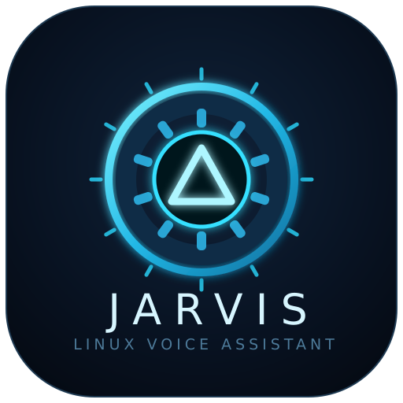

<p align="center">
  
</p>

<h1 align="center">JARVIS</h1>
<p align="center"><strong>Asistente de voz para Linux, orientado a tareas.</strong><br/>
Escucha · Transcribe · Ejecuta · Responde breve o en silencio.</p>

<p align="center">
  
  
  
  
  
  
</p>

---

## ✨ ¿Qué es Jarvis?

Jarvis es un asistente de voz **task-oriented** (no es un chatbot): recibe una orden hablada, detecta la intención con reglas deterministas y **ejecuta la acción** — subir el volumen, abrir una app, correr un comando o buscar en la web. Solo usa LLM (Groq u Ollama) como *fallback* cuando ningún patrón coincide, y responde en **máximo una frase** (o en silencio si todo salió bien).

```
🎙️ voz → 🔎 wake word → 📝 STT (faster-whisper) → 🧭 Router (reglas)
                                                        ├─ match fuerte → ⚡ Skill
                                                        └─ sin match → 🧠 Brain (Groq/Ollama/mock) → ⚡ Skill
                                                                                            → 🔊 Piper (o texto)
```

## 🚀 Características

| | |
|---|---|
| 🎯 **Reglas primero** | Router determinista con puntuación (regex, wildcards, frases, keywords). El LLM solo entra si el match es débil. |
| 🧩 **Skills modulares** | Cada habilidad es un archivo en `skills/`. Agregar una toma minutos. |
| 🔇 **Silencio ante el éxito** | Las acciones correctas no hablan; solo confirman lo riesgoso o lo que pide respuesta. |
| 🛡️ **Seguro por diseño** | Whitelist de comandos, confirmación con *“confirma”* y bloqueo absoluto de destructivos. |
| 💻 **Funciona sin micrófono** | Modo simulación por teclado si no hay `pyaudio`. Sin API key → modo offline con heurística. |
| ⚡ **Async de punta a punta** | `asyncio` en audio, STT, TTS, LLM y skills. |

## 📦 Instalación

### 1. Requisitos del sistema (Ubuntu/Debian)

```bash
# Herramientas de audio y control del sistema
sudo apt update
sudo apt install -y portaudio19-dev python3-venv alsa-utils \
  pulseaudio-utils brightnessctl wmctrl
```

> `portaudio19-dev` solo es necesario para el micrófono real (`pyaudio`). Sin él, Jarvis arranca igual en **modo simulación por teclado**.

### 2. Entorno Python e instalación

```bash
git clone https://github.com/jeronimoparra-ai/jarvis.git
cd jarvis
python3 -m venv venv
source venv/bin/activate
pip install -r requirements.txt
```

### 3. Configuración (opcional pero recomendada)

```bash
cp .env.example .env
# Edita .env y pon tu clave:
# GROQ_API_KEY=gsk_...
```

| Variable | Qué hace | Si la omites |
|---|---|---|
| `GROQ_API_KEY` | LLM rápido en la nube (fallback) | Usa Ollama local, luego modo offline |
| `LLM_PROVIDER` | `groq` u `ollama` | `groq` |
| `WAKE_WORD_ENGINE` | `openwakeword` o `vosk` | `openwakeword` |
| `STT_MODEL_SIZE` | `tiny`, `base`, `small`, `medium`, `large` | `small` |

El resto vive en `config.yaml` (dispositivos de audio, voces, skills activas).

### 4. Extras opcionales

```bash
# Voz en español para Piper (TTS real en vez de solo texto)
# Descarga una voz es_ES desde https://huggingface.co/rhasspy/piper-voices
# y apunta a ella en config.yaml → tts.voice

# Ollama local (LLM sin nube)
curl -fsSL https://ollama.com/install.sh | sh
ollama pull llama3
```

## ▶️ Uso

```bash
source venv/bin/activate
python main.py
```

Verás el modo simulación (o el mic si hay `pyaudio` + motor wake-word):

```
=== JARVIS modo simulación (sin micrófono) ===
jarvis> sube el volumen      # → silencio (hecho)
jarvis> ejecuta pwd           # → Jarvis: /home/usuario/jarvis
jarvis> qué es linux         # → Jarvis: resumen de Wikipedia + abre el navegador
jarvis> apaga el equipo      # → Jarvis: Vas a apagar el equipo. Di 'apaga, confirma'...
jarvis> salir                # → Jarvis: Hasta luego.
```

También acepta el wake word escrito: `hey jarvis, abre firefox`.

## 🧩 Skills incluidas

| Skill | Se activa con | Qué hace |
|---|---|---|
| 🔊 **system** (`skills/system.py`) | `volumen`, `brillo`, `apaga`, `reinicia`, `suspende`, `estado del sistema` | `pactl` / `brightnessctl` / `systemctl`. Energía **exige `confirma`**. |
| 🪟 **apps** (`skills/apps.py`) | `abre …`, `cierra …` | Lanza apps por alias (`navegador`, `terminal`, `vscode`…) o cierra con `pkill`. Enfoca la ventana vía `wmctrl`/`i3`/`sway` si existen. |
| ⌨️ **terminal** (`skills/terminal.py`) | `ejecuta …`, `corre …` | Whitelist directa (`ls`, `pwd`, `git`…), timeout 10 s, confirmación para lo sensible, bloqueo total de lo destructivo. |
| 🌐 **web** (`skills/web.py`) | `busca …`, `qué es …` | `busca X` abre DuckDuckGo en silencio; `qué es X` además **responde 1 frase de Wikipedia**. |

### Crear tu propia skill

```python
# skills/saludo.py
from skills.base import Skill

class SaludoSkill(Skill):
    patterns = ["hola jarvis", "buenos días"]
    intent = "saludo"

    async def execute(self, text, intent=None):
        return {"response": "A su servicio, señor.", "silent": False}
```

1. Crea `skills/mi_skill.py` con `patterns` + `execute(text, intent)`.
2. Añádela a `skills.enabled` en `config.yaml`.
3. Devuelve `{"response": "...", "silent": False}` para hablar, o `"silent": True` para ejecución silenciosa. Usa `"requires_confirmation": True` si la acción es riesgosa.

## 🛡️ Modelo de seguridad

- **Confirmación explícita**: apagar, reiniciar, suspender, `rm`/`mv`/`chmod`/`kill`, redirecciones y comandos desconocidos **no se ejecutan** sin la palabra `confirma` en la misma orden (*“apaga, confirma”*).
- **Bloqueo absoluto** (ni con confirmación): `mkfs`, `dd`, borrado de `/`, fork-bombs.
- **Terminal acotada**: whitelist de comandos seguros, timeout de 10 s, salida truncada a 500 caracteres.

## ⚙️ Arquitectura

```
jarvis/
├── main.py               # Entrypoint: config → skills → audio → loop (Ctrl+C limpio)
├── config.yaml / .env    # Config externa (.env manda sobre el YAML)
├── core/
│   ├── audio.py          # wake-word + grabación + STT + TTS + simulación por teclado
│   ├── router.py         # reglas con score → skill; débil/nulo → Brain
│   ├── brain.py          # Groq → Ollama → heurística offline + respuestas mock
│   └── skill_manager.py  # descubrimiento y carga de skills
├── skills/               # base.py + system, apps, terminal, web
├── utils/                # config.py (YAML + .env) y logger.py
├── tests/                # suite unittest (7 tests)
└── assets/logo.svg       # identidad del proyecto
```

## ✅ Tests

```bash
source venv/bin/activate
python -m unittest tests.test_basic -v
```

Cubre: routing determinista, fallback LLM, terminal segura/bloqueada, confirmación de `rm` y de apagado, y extracción de queries web.

## ⚠️ Limitaciones conocidas

- Sin `pyaudio`/mic → modo simulación por teclado (totalmente funcional).
- El wake-word neuronal puro requiere descargar modelos de openWakeWord/Vosk; con mic pero sin modelos se usa trigger por energía de voz.
- `faster-whisper` descarga el modelo (`small` ≈ 500 MB) en el primer uso.
- Piper necesita su binario + voz; si falta, las respuestas salen como texto.
- Volumen/brillo reales requieren `pactl`/`brightnessctl`.

## 🗺️ Roadmap

- [ ] Descarga automática del modelo wake-word + VAD real (silero/webrtcvad)
- [ ] Confirmación por voz (sí/no) con estado de pending-action
- [ ] Skill de temporizadores y recordatorios
- [ ] Skill domótica (MQTT) y calendario
- [ ] Empaquetado `.deb` / servicio `systemd --user`

## 📄 Licencia

MIT — ver [LICENSE](LICENSE).

<p align="center">Hecho con ⚡ para Linux. <strong>A su servicio, señor.</strong></p>
